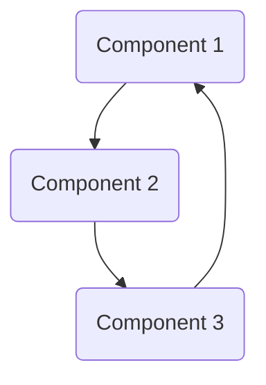

# Software Architecture

## Introduction

This document describes the architecture of the software system. It provides a high-level overview of the system's components and their interactions.

## Components

The software system consists of the following components:

1. **Component 1**: Description of component 1.
2. **Component 2**: Description of component 2.
3. **Component 3**: Description of component 3.

## Interactions

The components interact with each other in the following ways:

1. **Interaction 1**: Description of interaction 1.
2. **Interaction 2**: Description of interaction 2.
3. **Interaction 3**: Description of interaction 3.

## Diagram

The following diagram illustrates the architecture of the software system:



## Conclusion

This document has provided an overview of the software system's architecture. It serves as a guide for developers and stakeholders to understand the system's design and structure.

```